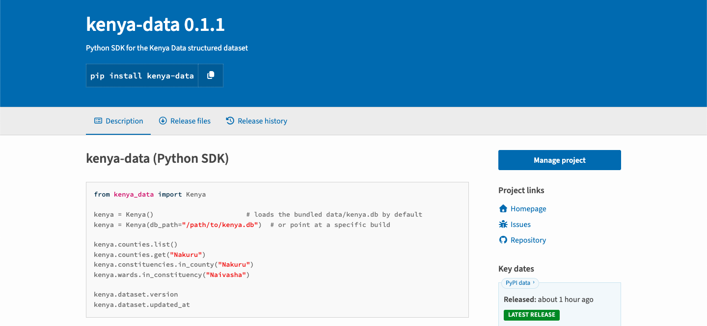
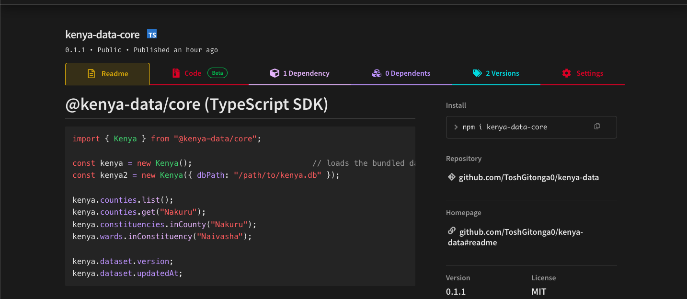

# Kenya Data

[](https://github.com/ToshGitonga0/kenya-data/actions/workflows/ci.yml)
[](LICENSE)
[](https://www.npmjs.com/package/kenya-data-core)
[](https://pypi.org/project/kenya-data/)

> A structured, versioned, and developer-friendly data layer for Kenya.

Kenya Data provides structured Kenyan administrative and geographic data through a portable SQLite database and native Python and TypeScript SDKs.

The project currently provides:

* **47 counties**
* **290 constituencies**
* **1,450 wards**
* County → constituency and constituency → ward relationships
* Stable identifiers and codes
* Dataset version and update metadata
* A bundled, read-only SQLite database
* Native Python and TypeScript APIs

## Current release

| Package | Registry | Version |
| --- | --- | ---: |
| Python | [PyPI](https://pypi.org/project/kenya-data/) | `0.1.1` |
| TypeScript | [npm](https://www.npmjs.com/package/kenya-data-core) | `0.1.1` |

The current dataset is `2026.09-iebc2012-knbs2019` (`approved`), updated on `2026-09-20`.

## Packages in action

The same dataset is published for both Python and TypeScript, so applications can use the SDK that best fits their stack. The screenshots below show the packages as published in their respective registries.

### Python package on PyPI

The Python SDK is available on PyPI as [`kenya-data`](https://pypi.org/project/kenya-data/), making the administrative dataset installable with standard Python tooling.



### TypeScript package on npm

The TypeScript SDK is available on npm as [`kenya-data-core`](https://www.npmjs.com/package/kenya-data-core), with the bundled SQLite database ready for use in JavaScript and TypeScript projects.



## Quick start

### Python

```python
from kenya_data import Kenya

kenya = Kenya()

print(kenya.counties.list())
print(kenya.counties.get("Nakuru"))
print(kenya.constituencies.in_county("Nakuru"))
print(kenya.wards.in_constituency("Naivasha"))

kenya.close()
```

Install it with:

```bash
pip install kenya-data
```

### TypeScript

```typescript
import { Kenya } from "kenya-data-core";

const kenya = new Kenya();

console.log(kenya.counties.list());
console.log(kenya.counties.get("Nakuru"));
console.log(kenya.constituencies.inCounty("Nakuru"));
console.log(kenya.wards.inConstituency("Naivasha"));

kenya.close();
```

Install it with:

```bash
npm install kenya-data-core
```

## What you get

Kenya Data models a simple administrative hierarchy:

```text
Kenya
├── Counties (47)
│   └── Constituencies (290)
│       └── Wards (1,450)
└── Dataset metadata
```

Every record has stable identifiers and relationships to the level above it. For example, Nairobi contains 17 constituencies, and those relationships are represented directly in the dataset.

The SDKs also expose dataset metadata:

```python
print(kenya.dataset.version)
print(kenya.dataset.updated_at)
print(kenya.dataset.info())
```

```typescript
console.log(kenya.dataset.version);
console.log(kenya.dataset.updatedAt);
console.log(kenya.dataset.info());
```

## Data integrity

The published `kenya-data==0.1.1` and `kenya-data-core@0.1.1` packages have been tested from clean environments using PyPI and npm. Both distributions were verified to provide:

* 47 counties, 290 constituencies, and 1,450 wards
* A working bundled SQLite database
* Matching dataset metadata
* Correct Nairobi and constituency relationships
* Valid constituency-to-county and ward-to-constituency references

Relationship validation returned:

```text
Constituencies with invalid county: 0
Wards with invalid constituency: 0
```

## Data provenance

Kenya Data documents its sources, retrieval information, dataset versions, transformations, validation procedures, data-model decisions, known discrepancies, and approval status. The current dataset incorporates documented Kenyan administrative and geographic information, including IEBC delimitation data and KNBS census data.

See:

* [Data research](docs/data-research.md)
* [Source policy](docs/source-policy.md)
* [Source registry](research/source-registry/)
* [Approved data](data/approved/)

## Architecture

The project follows this pipeline:

```text
Data sources → Research → Source registry → Ingestion → Validation
      → Approved data → SQLite → Python SDK / TypeScript SDK
```

SQLite is the common distribution layer used by both SDKs. It is portable, serverless, self-contained, easy to inspect, and requires no API key or database server for ordinary queries.

More detail is available in:

* [Architecture](docs/architecture.md)
* [Data model](docs/data-model.md)
* [Data quality](docs/data-quality.md)
* [SDK design](docs/sdk-design.md)
* [Versioning](docs/versioning.md)

## Installation and verification

Python requires Python 3.9+:

```bash
pip install kenya-data
python -c "from kenya_data import Kenya; print(len(Kenya().counties.list()))"
```

Expected output: `47`.

For TypeScript and JavaScript:

```bash
npm install kenya-data-core
npm list kenya-data-core
```

## Local development

```bash
git clone https://github.com/ToshGitonga0/kenya-data.git
cd kenya-data
make setup
make build-db
make validate
make test
make lint
```

Use `make inspect-db` to inspect the generated SQLite database.

## Project structure

```text
kenya-data/
├── data/          # Approved data and the SQLite database
├── docs/          # Architecture, quality, research, and SDK documentation
├── packages/      # Python and TypeScript SDKs
├── research/      # Sources, investigations, and discrepancies
├── screenshots/   # Registry screenshots used in this README
├── Makefile
├── CONTRIBUTING.md
├── LICENSE
└── README.md
```

## Contributing

Contributions are welcome. Depending on the change, contributions may involve research, source documentation, data transformation, validation, tests, documentation, or SDK implementation. Changes to the dataset should preserve provenance and validation information.

See [CONTRIBUTING.md](CONTRIBUTING.md) for the contribution workflow.

## License

Kenya Data is released under the MIT License. See [LICENSE](LICENSE) for the full license text.

## Project links

* [Repository](https://github.com/ToshGitonga0/kenya-data)
* [Python package on PyPI](https://pypi.org/project/kenya-data/)
* [TypeScript package on npm](https://www.npmjs.com/package/kenya-data-core)
